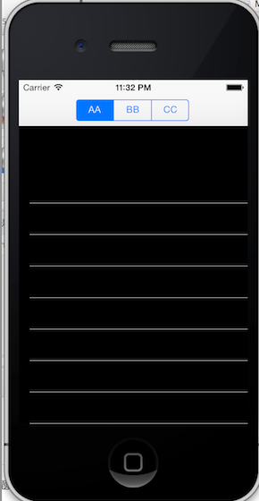

bugs
====

一些蛋都碎了的问题...

###SubViewsPosition
先看图：

都是一样的view，为什么第一个就空出一块呢？好像在界面show之前，addSubView的第一个view会有特殊对待。

#####解决方案有两种：
方案A.代码里的方法2，把方法1屏蔽掉，放开方法2. 太尼玛奇葩了，延迟加载一下就行了呀！！尼玛啊

方案B.
  ①将几个view的frame初始化改为CGRectMake(0,0,320,56);       
  ②添加初始化view后添加代码, 不要给第一个view setContentInset了，因为第一个会特殊对待！
  
    UIEdgeInsets edgeInsets =  UIEdgeInsetsMake(65, 0, 0, 0);
    [viewComments setContentInset:edgeInsets];
    [viewMails setContentInset:edgeInsets];
    
方案C.

	//禁用iOS7新加入的布局特性
	if ([self respondsToSelector:@selector(setEdgesForExtendedLayout:)])
	{
	    self.edgesForExtendedLayout = UIRectEdgeNone;
	}

您敢说这不是Bug？！

###ImageMoved
将tableView下滑到底部，然后再滑上去发现图片不但位置变了，大小也变了呀。
原因：自定义Cell的imageView属性和基类UITableViewCell中的属性imageView重名了！！！尼玛重名啊。。。也不给个警告什么的。
