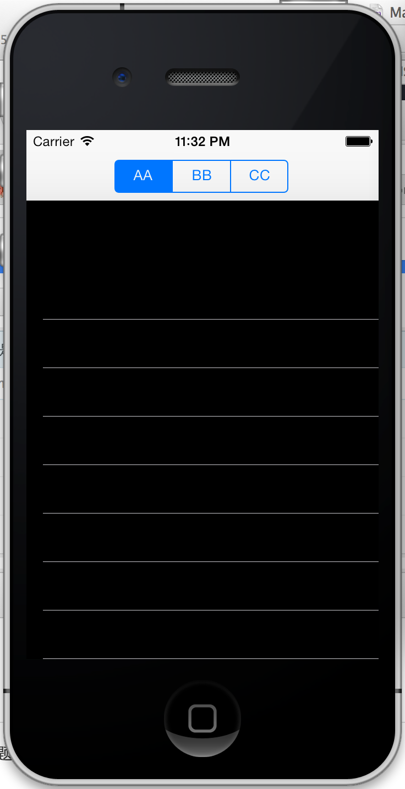

bugs
====

一些蛋都碎了的问题...

###ChangeViews
先看图：

都是一样的view，为什么第一个就空出一块呢？好像在界面show之前，addSubView的第一个view会有特殊对待。

#####解决方案：
1.代码里的方法2，把方法1屏蔽掉，放开方法2. 太尼玛奇葩了，延迟加载一下就行了呀！！尼玛啊

2.
  ①将几个view的frame初始化改为CGRectMake(0,0,320,56);       
  ②添加初始化view后添加代码, 不要给第一个view setContentInset了，因为第一个会特殊对待！
  
    UIEdgeInsets edgeInsets =  UIEdgeInsetsMake(65, 0, 0, 0);
    [viewComments setContentInset:edgeInsets];
    [viewMails setContentInset:edgeInsets];
    
您敢说这不是Bug？！
